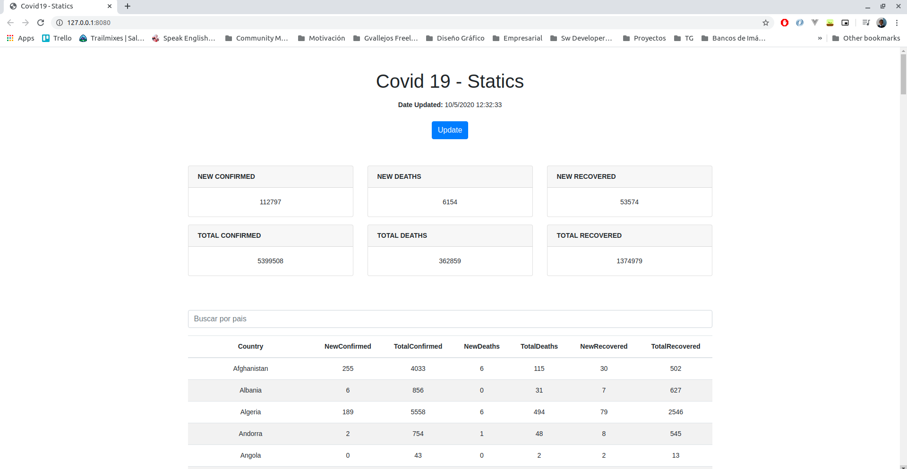

# COVID19-statics

## Description
Project to show Covid19 statics focusing on help people to be aware of the viru's numbers updates.

## Technical Description
This project has been created to practice Js Promises.
- Getting data from https://covid19api.com/
- Accesing to the API by Jquery $get and using promises.

## How to install/run
- For getting node_modules: `npm init -y`
- For run: `npm start`

## How to use
Just see the last statics and filter numbers by country.

## License
MIT

## Author Info
Bch. Gian Vallejos - Software Engineer